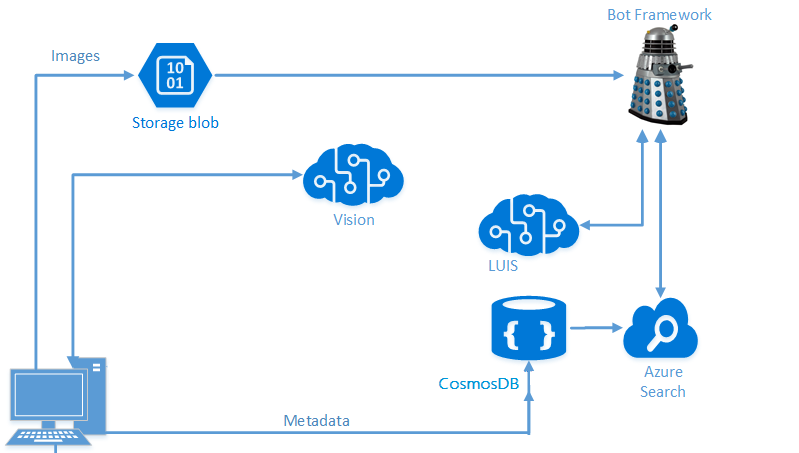

# Developing Intelligent Bots with LUIS 

This hands-on lab guides you through creating an intelligent bot from end-to-end using the Microsoft Bot Framework and Microsoft's Language Understanding Intelligent Service (LUIS).  It is a shortened version of the Microsoft AI Developer lab.
> This lab was modified from  [LearnAI Boot Camp Training Materials](https://github.com/Azure/LearnAI-Bootcamp).

## Objectives
In this workshop, you will:
- Create a simple bot in the Azure portal and test it online.
- Build a LUIS application.
- Build the final bot using LUIS and Azure Search (Azure search has already been set up for you).

While there is a focus on LUIS and Azure bot framework, you will also leverage the following technologies:
- Visual Studio
- Bot emulator

## Introduction
The end solution will be built using the Bot Framework and LUIS to allow easy, targeted querying. Cognitive Services to find objects and people in  images, stores the data in a NoSQL Store (CosmosDB). This NoSQL Store  populate an Azure Search index.

## Navigating the Labs

This workshop has been broken down into 3 sections:
- [1_Test_Simple_Bot](./1_Test_Simple_Bot.md): Here you will build a simple bot using Regular Expressions and Scorable Groups
- [2_LUIS](./2_LUIS.md): We'll configure our bot for Azure Search and connect it to the Azure Search service from the previous lab
- [3_Publish_and_Register](./3_Publish_and_Register.md): We'll finish by publishing and registering our bot.

### Continue to[1_Test_Simple_Bot](./1_Test_Simple_Bot.md)

