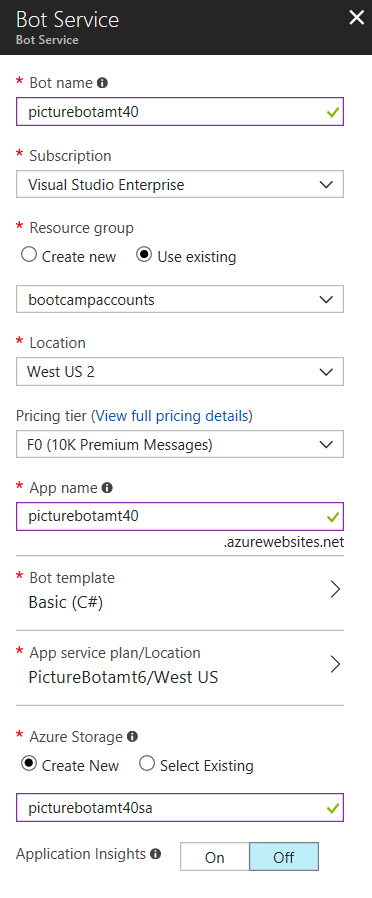

## 1_Test_Simple_Bot:
Estimated Time: 10-15 minutes

## Lab 1.1 Creating a simple Bot
A bot created using the Microsoft Bot Framework can be hosted at any publicly-accessible URL.  For the purposes of this lab, we will register our bot using [Azure Bot Service](https://docs.microsoft.com/en-us/bot-framework/bot-service-overview-introduction).

Navigate to the portal. In the portal, click "Create a resource" and search for "bot". Select Web App Bot, and click create. For the name, you'll have to create a unique identifier. I recommend using something along the lines of PictureBot[i][n] where [i] is your initials and [n] is a number (e.g. mine would be PictureBotamt40). Put in the region that is closest to you.
For pricing tier, select F0, as that is all we will need for this workshop. Set the bot template to LUIS (C#), and configure a new App service plan (put it in the same location as your bot). It doesn't matter which template you choose, because we will overwrite it with our PictureBot. Turn off Application Insights (to save money). Click create.

 

You have just published a very simple LUISBot 

### Lab 1.2 Managing your bot from the portal

Return to the portal to your Web App Bot resource. Under Bot Management, select "Test in Web Chat" to test if your bot has been published and is working accordingly. If it is not, review the previous lab, because you may have skipped a step. Re-publish and return here.

After you've confirmed your bot is published and working, check out some of the other features under Bot Management. Select "Channels" and notice there are many channels, and when you select one, you are instructed on how to configure it. Try the using the http from the iFrame and Skype.

Want to learn more about the various aspects related to bots? Spend some time reading the [how to's and design principles](https://docs.microsoft.com/en-us/bot-framework/bot-service-design-principles).

### Continue to [2_LUIS](./2_LUIS.md)  
Back to [README](./0_README.md)