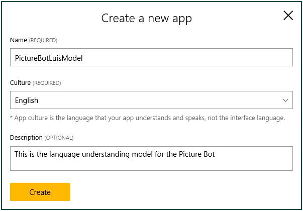
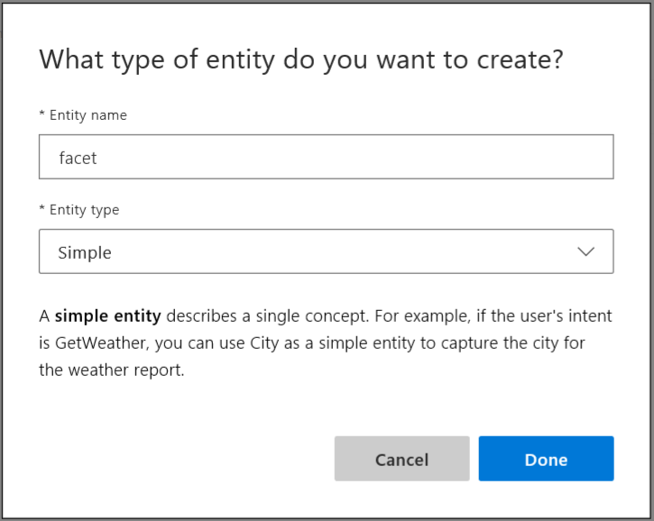
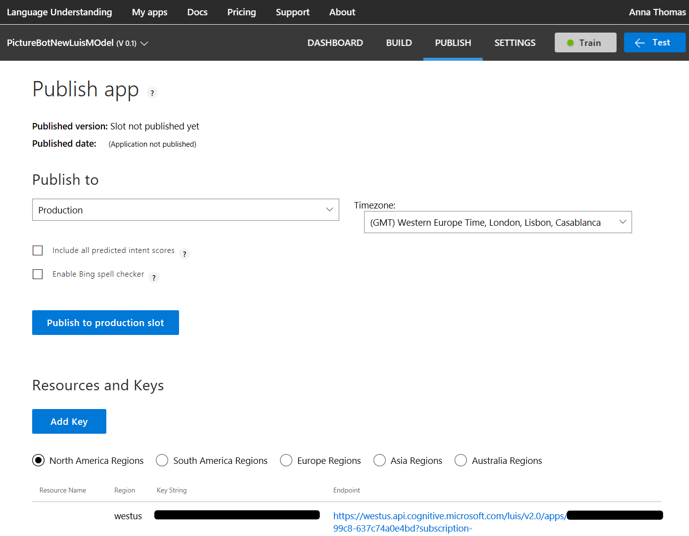
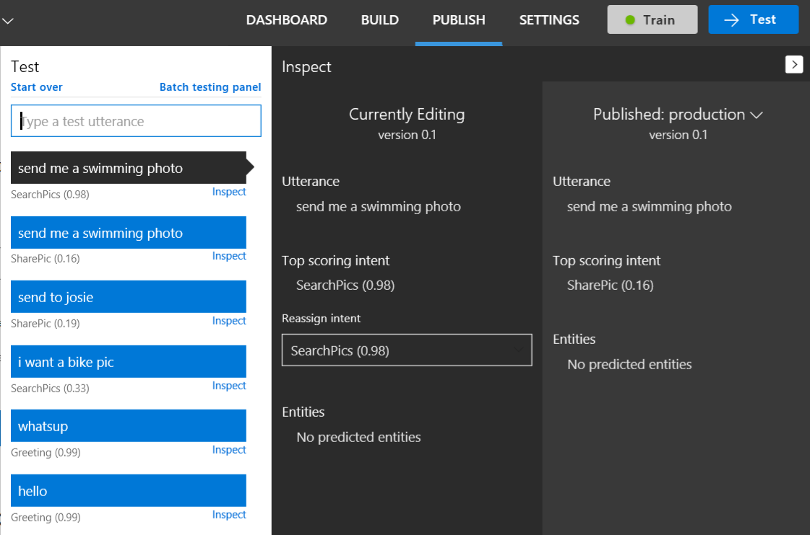

## 2_Luis:
Estimated Time: 20-30 minutes

## LUIS

First, let's [learn about Microsoft's Language Understand Intelligent Service (LUIS)](https://docs.microsoft.com/en-us/azure/cognitive-services/LUIS/Home).

Now that we know what LUIS is, we'll want to plan our LUIS app. We will be using this in our bot that returns images based on our search, that we can then share or order. We will need to create intents that trigger the different actions that our bot can do, and then create entities to model some parameters than are required to execute that action. For example, an intent for our PictureBot may be "SearchPics" and it triggers Azure Search service to look for photos, which requires a "facet" entity to know what to search for. You can see more examples for planning your app [here](https://docs.microsoft.com/en-us/azure/cognitive-services/LUIS/plan-your-app).

Once we've thought out our app, we are ready to [build and train it](https://docs.microsoft.com/en-us/azure/cognitive-services/LUIS/luis-get-started-create-app). These are the steps you will generally take when creating LUIS applications:
  1. [Add intents](https://docs.microsoft.com/en-us/azure/cognitive-services/LUIS/add-intents) 
  2. [Add utterances](https://docs.microsoft.com/en-us/azure/cognitive-services/LUIS/add-example-utterances)
  3. [Add entities](https://docs.microsoft.com/en-us/azure/cognitive-services/LUIS/add-entities)
  4. [Improve performance using features](https://docs.microsoft.com/en-us/azure/cognitive-services/LUIS/add-features)
  5. [Train and test](https://docs.microsoft.com/en-us/azure/cognitive-services/LUIS/train-test)
  6. [Use active learning](https://docs.microsoft.com/en-us/azure/cognitive-services/LUIS/label-suggested-utterances)
  7. [Publish](https://docs.microsoft.com/en-us/azure/cognitive-services/LUIS/publishapp)

### Lab 2.1: Creating the LUIS service in the portal

In the Portal, hit **Create a resource** and then enter **LUIS** in the search box and choose **Language Understanding Intelligent Service**:

This will lead you to fill out a few details for the API endpoint you'll be creating, choosing the API you're interested in and where you'd like your endpoint to reside (choose **West US**), as well as what pricing plan you'd like.  The free tier is sufficient for this lab. Since LUIS stores images internally at Microsoft (in a secure fashion), to help improve future Cognitive Services offerings, you'll need to check the box to confirm you're ok with this.

Once you have created your new API subscription, you can grab the key from the appropriate section of the blade and add it to your list of keys.

### Lab 2.2: Adding intelligence to your applications with LUIS

First, let's look at how we can use LUIS to add some natural language capabilities. LUIS allows you to map natural language utterances (words/phrases/sentences the user might say when talking to the bot) to intents (tasks or actions the user wants to perform).  For our application, we might have several intents: finding pictures, sharing pictures, and ordering prints of pictures, for example.  We can give a few example utterances as ways to ask for each of these things, and LUIS will map additional new utterances to each intent based on what it has learned.  

Navigate to [https://www.luis.ai](https://www.luis.ai). If this is the first time you login with LUIS, scroll to the bottom of the page and click **Create LUIS app**
  
> Fun Aside: Notice that there is also an "Import App" next to the "New App" button on [the current page](https://www.luis.ai/applications).  After creating your LUIS application, you have the ability to export the entire app as JSON and check it into source control.  This is a recommended best practice, so you can version your LUIS models as you version your code.  An exported LUIS app may be re-imported using that "Import App" button.  If you fall behind during the lab and want to cheat, you can click the "Import App" button and import the [LUIS model](./resources/code/LUIS/PictureBotLuisModel.json).  

From the main page, click the "Create new app" button.  Give it a name (I chose "PictureBotLuisModel") and set the Culture to "English".  You can optionally provide a description. Then click "Done".  

 

You will be taken to the Build section for your new app. 

 

> Note that there is one intent called "None".  Random utterances that don't map to any of your intents may be mapped to "None".  

We want our bot to be able to do the following things:
+ Search/find pictures
+ Share pictures on social media
+ Order prints of pictures
+ Greet the user (although this can also be done other ways as we will see later)

Let's create intents for the user requesting each of these.  Click the "Create new intent" button.  

Name the first intent "Greeting" and click "Done".  Then give several examples of things the user might say when greeting the bot, pressing "Enter" after each one.  

 

Let's see how to create an entity.  When the user requests to search the pictures, they may specify what they are looking for.  Let's capture that in an entity.  

Click on "Entities" in the left-hand column and then click "Create new entity".  Give it an entity name "facet" and entity type ["Simple"](https://docs.microsoft.com/en-us/azure/cognitive-services/LUIS/luis-concept-entity-types).  Then click "Done".  

 

Next, click "Intents" in the left-hand sidebar and then click the blue "Create new intent" button.  Give it an intent name of "SearchPics" and then click "Done".  

Just as we did for Greetings, let's add some sample utterances (words/phrases/sentences the user might say when talking to the bot).  People might search for pictures in many ways.  Feel free to use some of the utterances below, and add your own wording for how you would ask a bot to search for pictures. 

+ Find outdoor pics
+ Are there pictures of a train?
+ Find pictures of food.
+ Search for photos of boys playing
+ Please give me pics of business women
+ Show me beach pics
+ I want to find dog photos
+ Search for pictures of men indoors
+ Show me pictures of men wearing glasses
+ I want to see pics of sad boys
+ Show me happy baby pics

Once we have some utterances, we have to teach LUIS how to pick out the **search topic** as the "facet" entity. Whatever the "facet" entity picks up is what will be searched. Hover and click the word (or click consecutive words to select a group of words) and then select the "facet" entity. 

 

So your utterances may become something like this when facets are labeled:

 
 

Finally, click "Intents" in the left sidebar and add two more intents:
+ Name one intent **"SharePic"**.  This might be identified by utterances like "Share this pic", "Can you tweet that?", or "post to Twitter".  
+ Create another intent named **"OrderPic"**.  This could be communicated with utterances like "Print this picture", "I would like to order prints", "Can I get an 8x10 of that one?", and "Order wallets".  
When choosing utterances, it can be helpful to use a combination of questions, commands, and "I would like to..." formats.  

We are now ready to train our model.  Click "Train" in the top right bar.  This builds a model to do utterance --> intent mapping with the training data you've provided. Training is not always immediate. Sometimes, it gets queued and can take several minutes.

Then click on "Publish" in the top bar.  You have several options when you publish your app, including enabling [including all predicted intent scores or Bing spell checker](https://docs.microsoft.com/en-us/azure/cognitive-services/LUIS/PublishApp). If you have not already done so, select the endpoint key that you set up earlier, or follow the link to add a key from your Azure account.  You can leave the endpoint slot as "Production".  Then click "Publish".  

 

Publishing creates an endpoint to call the LUIS model.  The URL will be displayed, which will be explained in a later lab.

Click on "Test" in the top right bar. Try typing a few utterances and see the intents returned. Familiarize yourself with [Interactive Testing](https://docs.microsoft.com/en-us/azure/cognitive-services/LUIS/Train-Test#interactive-testing) and [Relabeling Utterances/Retraining](https://docs.microsoft.com/en-us/azure/cognitive-services/LUIS/Train-Test#relabel-utterances-and-retrain) as you may want to do this now or in a future lab. 

One quick example is shown below. I have noticed that my model incorrectly assigned "send me a swimming photo" as SharePic, when it should be SearchPic. I reassigned the intent.

 

Now I need to retrain my app by selecting the Train button. I then tested the same utterance and compared the results between my recently trained and previously published model. 

 

You can also [test your published endpoint in a browser](https://docs.microsoft.com/en-us/azure/cognitive-services/LUIS/PublishApp#test-your-published-endpoint-in-a-browser). Copy the URL, then replace the `{YOUR-KEY-HERE}` with one of the keys listed in the Key String column for the resource you want to use. To open this URL in your browser, set the URL parameter `&q` to your test query. For example, append `&q=Find pictures of dogs` to your URL, and then press Enter. The browser displays the JSON response of your HTTP endpoint.

If you still have time, spend time exploring the www.luis.ai site. Select "Prebuilt domains" and see [what is already available for you](https://docs.microsoft.com/en-us/azure/cognitive-services/luis/luis-reference-prebuilt-domains). You can also review some of the [other features](https://docs.microsoft.com/en-us/azure/cognitive-services/luis/luis-concept-feature). 

### Continue to [3_Publish_and_Register](./3_Publish_and_Register.md)  
Back to [README](./0_README.md)
