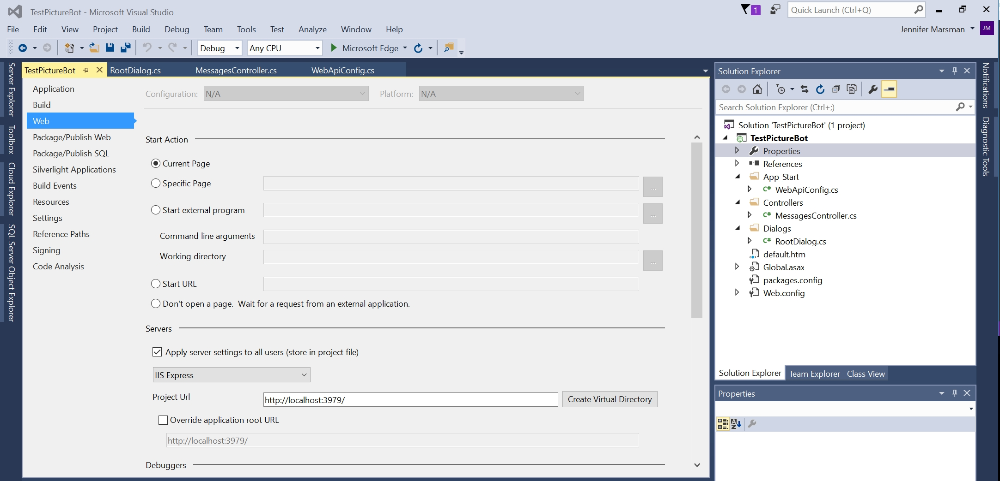
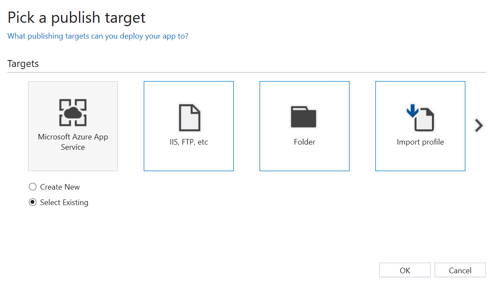
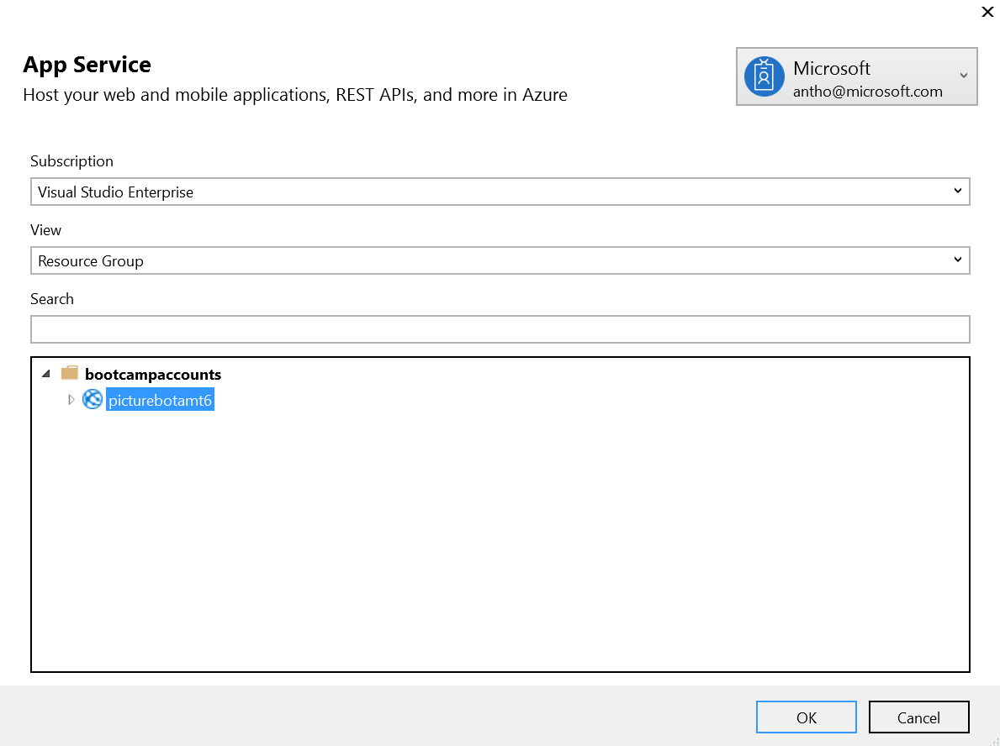
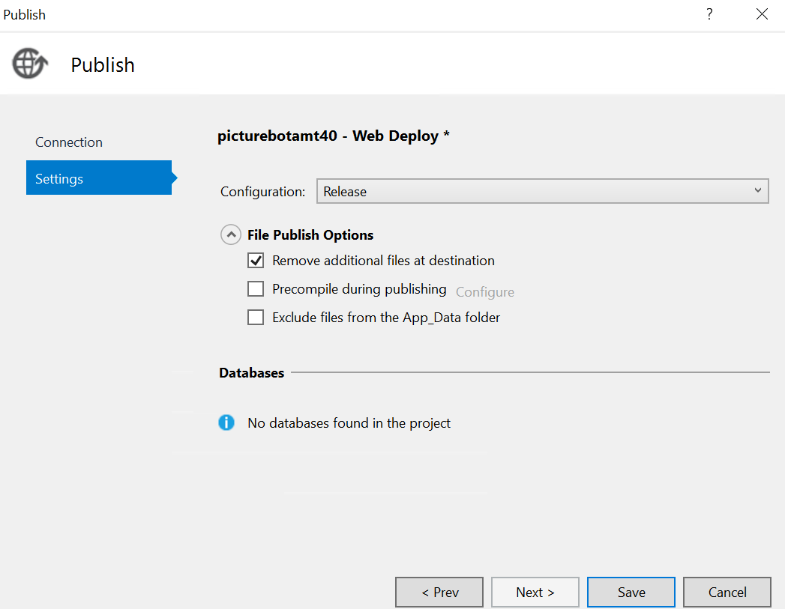

## 3_Publish_and_Register:
Estimated Time: 20-30 minutes

### Lab 3.1: Download the bot
In the [resources](./resources) folder naviage to:
 **Finished-PictureBot_LUIS**: Here  is the finished PictureBot.sln that includes additions for Regex, LUIS and Azure Search. Open the solution (sln) in visual studio.
 
 You can hit F5 to confirm it builds correctly.

Browse around and examine the  bot code.  In particular, note:
+ In **WebApiConfig.cs** under App_Start, the route template is api/{controller}/{id} where the id is optional.  That is why we always call the bot's endpoint with api/messages appended at the end.  
+ The **MessagesController.cs** under Controllers is therefore the entry point into your bot.  Notice that a bot can respond to many different activity types, and sending a message will invoke the RootDialog.  
+ In **RootDialog.cs** under Dialogs, "StartAsync" is the entry point which waits for a message from the user, and "MessageReceivedAsync" is the method that will handle the message once received and then wait for further messages.  We can use "context.PostAsync" to send a message from the bot back to the user.  

Click F5 to run the sample code.  NuGet should take care of downloading the appropriate dependencies.  

The code will launch in your default web browser in a URL similar to http://localhost:3979/.  

> Fun Aside: why this port number?  It is set in your project properties.  In your Solution Explorer, double-click "Properties" and select the "Web" tab.  The Project URL is set in the "Servers" section.  

 

### Lab 3.2: Update with your bot keys
First we need to grab a few keys. Go to the Web App Bot you just created (in the portal). Under App Service Settings->Application Settings->App settings, grab the BotId, MicrosoftAppId, and MicrosoftAppPassword. You will need them in a moment.

Return to your PictureBot in Visual Studio. In the Web.config file, fill in the the blanks under `appSettings` with the BotId, MicrosoftAppId, and MicrosoftAppPassword. Save the file. 

> Getting an error that directs you to your MicrosoftAppPassword? Because it's in XML, if your key contains "&", "<", ">", "'", or '"', you will need to replace those symbols with their respective [escape facilities](https://en.wikipedia.org/wiki/XML#Characters_and_escaping): "\&amp;", "\&lt;", "\&gt;", "\&apos;", "\&quot;". 

### Lab 3.2: Update with your LUIS keys
Next, update with the LUIS App ID and LUIS key under RootDialog.  If you can't find these values, go back to http://luis.ai.  Click on your application, and go to the "Publish App" page. You can get the LUIS App ID and LUIS key from the Endpoint URL (HINT: The LUIS App ID will have hyphens in it, and the LUIS key will not). You will need to put the following line of code directly above the `[Serializable]` with your LUIS App ID and LUIS key:

```csharp

namespace PictureBot.Dialogs
{
    [LuisModel("YOUR-APP-ID", "YOUR-SUBSCRIPTION-KEY")]
    [Serializable]

...
```

### Lab 3.3: Update with the search keys
Provide our bot with the relevant information to connect to an Azure Search index.  The best place to store connection information is in the configuration file.  

Open Web.config and in the appSettings section, add the following:

```xml    
    <!-- Azure Search Settings -->
    <add key="SearchDialogsServiceName" value="" />
    <add key="SearchDialogsServiceKey" value="" />
    <add key="SearchDialogsIndexName" value="images" />
```

Set the value for the SearchDialogsServiceName to be the name of the Azure Search Service that you can find in the main resource group.  

Set the value for the SearchDialogsServiceKey to be the key for this service.  This can be found in the [Azure portal](https://portal.azure.com) under the Keys section for your Azure Search.  In the below screenshot, the SearchDialogsServiceName would be "aiimmersionsearch" and the SearchDialogsServiceKey would be "375...".  

 

### (Optional) Lab 3.3: Test  your bot locally
Make sure your project is still running (hit F5 again if you stopped to look at the project properties) and launch the Bot Framework Emulator.  (If you just installed it, it may not be indexed to show up in a search on your local machine, so remember that it installs to c:\Users\your-username\AppData\Local\botframework\app-3.5.27\botframework-emulator.exe.)  Ensure that the Bot URL matches the port number that your code launched in above, and has api/messages appended to the end.  You should be able to converse with the bot.  

 

### Lab 3.4: Publish your bot
In the Solution Explorer, right-click on your Bot Application project and select "Publish".  This will launch a wizard to help you publish your bot to Azure.  

Select the publish target of "Microsoft Azure App Service" and "Select Existing."  

 

On the App Service screen, select the appropriate subscription, resource group, and your Bot Service. Select Publish.

 

> If you get an error here, simply exit the browser window within Visual Studio and complete the next step.

Now, you will see the Web Deploy settings, but we have to edit them one last time. Select "Settings" under the publish profile. Select Settings again and check the box next to "Remove additional files at destination". Click "Save" to exit the window, and now click "Publish".  The output window in Visual Studio will show the deployment process.  Then, your bot will be hosted at a URL like http://picturebotamt6.azurewebsites.net/, where "picturebotamt6" is the Bot Service app name.  

 


Back to [README](./0_README.md)

